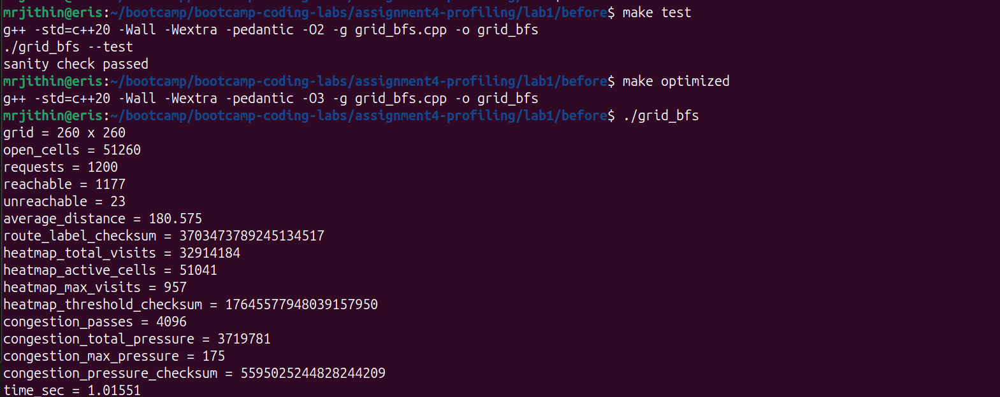
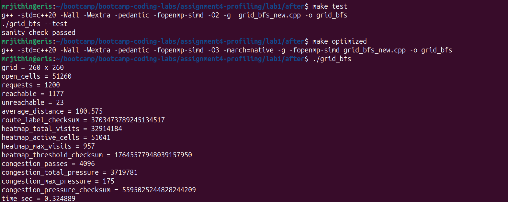

# Intro Profiling Lab Report

## 1. Optimizations Made

- TODO

## 2. Methodology Walkthrough

Include before/after evidence from:

- `time`
- `perf stat`
- FlameGraph
- Callgrind/KCachegrind
- Valgrind leak summary

## 3. Correctness Evidence

### Before:

### After: 

## 4. Conceptual Questions

A1.1: user+sys computes the time spent by the CPU actually running the program while real calculates the real time elapsed from the start of the program till the end. Since the program may wait for processes like I/O or for other programs to run in between, the real time may not match user+sys time. 

A2.1: These event counts are read directly from CPU's Performance Monitoring Units (PMUs) which are present as hardware. These event counts are used by perf program to calculate derived metrics.

A2.2: Since the CPU has limit counting units, if we try to measure more parameters than available units, the CPU has to rotate among the parameters. So the percentage denotes the active percentage of time the specific parameter was measured. 

A2.3: Due to the above rotating of PMUs, the count is not exact and is approximated. 

A3.1: Frame pointers store a pointer to the base of the stack frame of the current executing function. This also acts as a linked list since once a function returns, the frame pointer updates to the pointer to the calling function. The perf record -g reads the frame pointer and the memory address it points to, to get the previous pointer and so on until it reaches the end of the call stack to build the call graph. 

A3.2: Inclusive cost includes all resources used by the function including its children calls whereas self cost only includes the resources used for running the given function without considering the resources used by any function it calls. 

A4.1: gprof modifies the program binary and inserts a tracking function into the code during compilation. The inserted function inspects the program counter to determine the caller and callee and correspondingly increase the counts in a hidden hash table in memory. This hash table is ultimately dumped to gmon.out. 

A4.2: gprof can be used to get the exact call count of a function since unlike perf it doesn't rely on statistical profiling and instead relies on modifying the binary to inject new functions to profile the program. 

A5.1: Valgrind runs an already existing binary in a simulator to catch memory bugs whereas AddressSanitizer injects code into the binary and requires recompilation. Valgrind can be used to catch non deterministic bugs or when we cannot recompile the binary. ASan can be used in general since it is faster to use and catches most bugs. 

A6.1: perf reports recursion in `compute_congestion_pressure` whereas gprof shows it is only called once by `main`. The primary bottleneck is identified as `shortest_path_bfs` by perf whereas it is identified as `std::vector<int>::operator[]` by gprof. These are not real contradictions because we measure on different binaries. gprof measures on binary without optimisations like loop unrolling and hence reports different bottlenecks.  