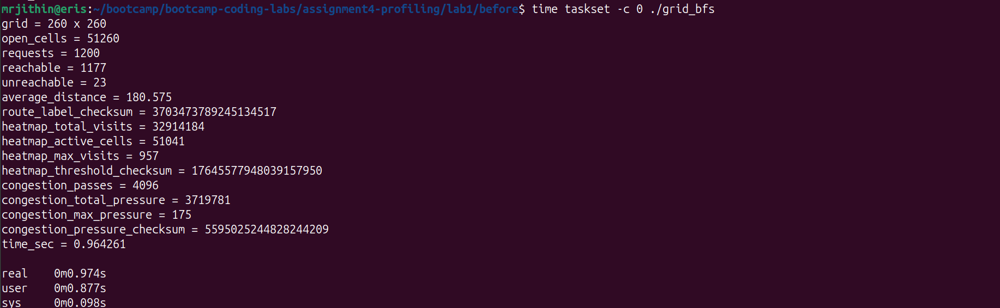
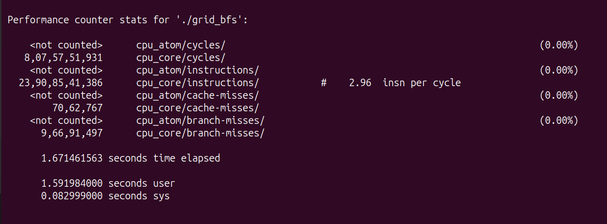
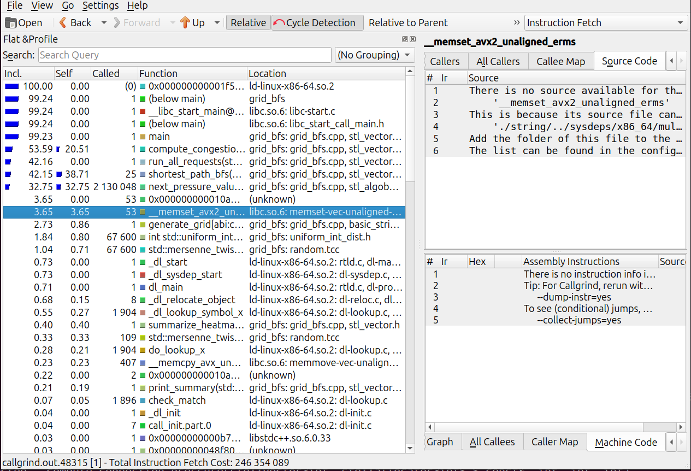
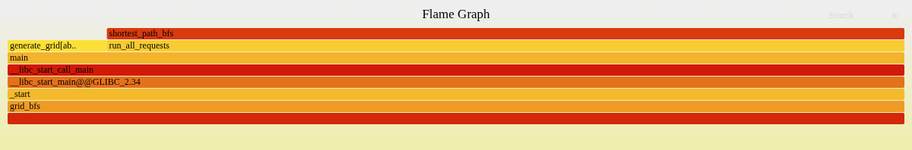
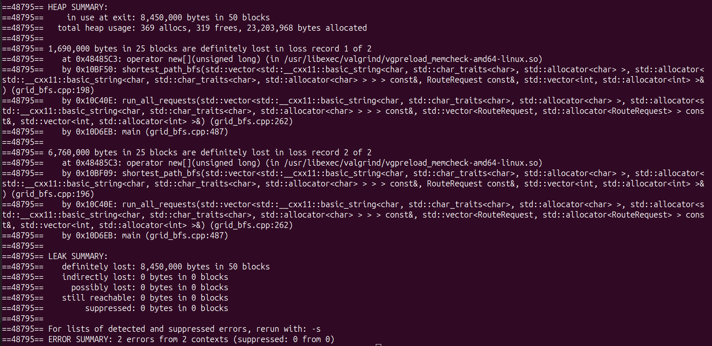
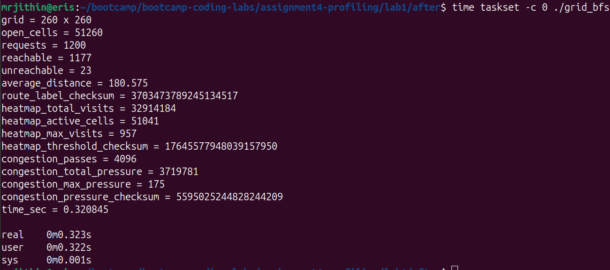
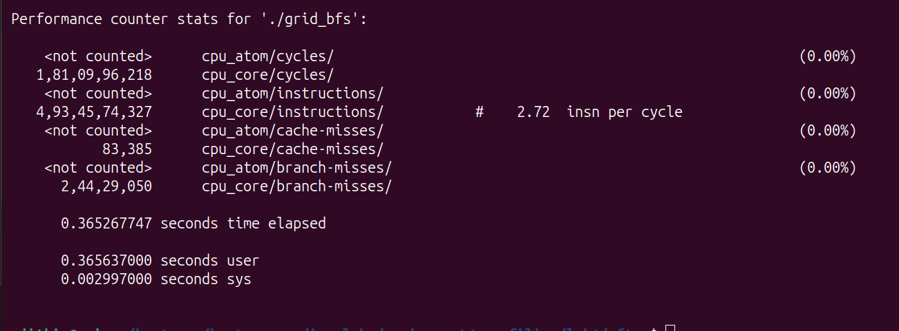
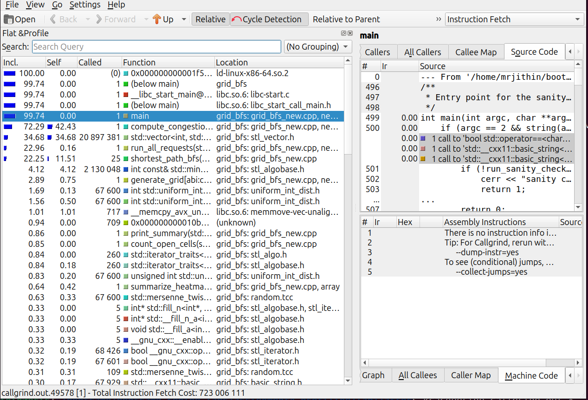
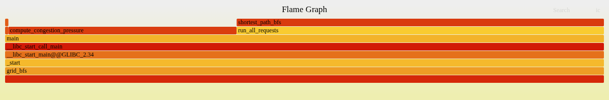
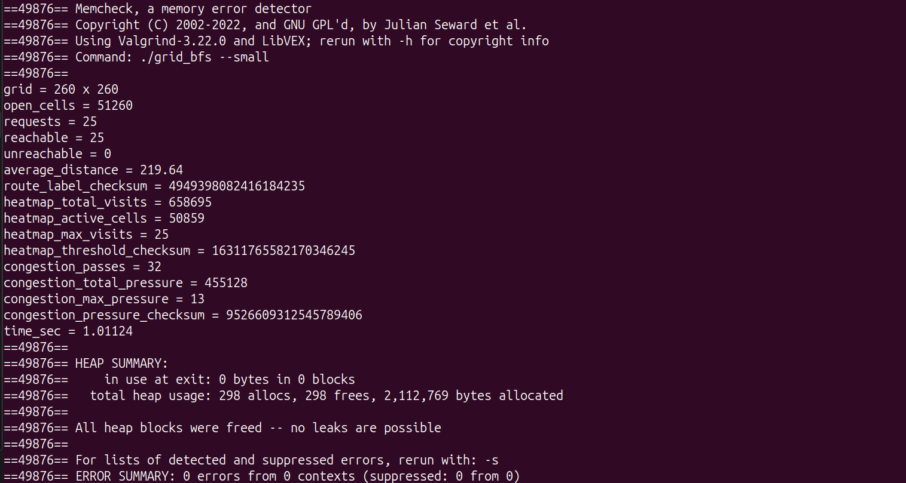

# Intro Profiling Lab Report

## 1. Optimizations Made

- Memory Leak Resolution: Replaced raw new pointer allocations in shortest_path_bfs with a single memcpy from a pre-allocated vector. This resolved severe memory leaks and removed the overhead of dynamic allocation on every BFS request.

- Grid Flattening: Converted the 2D grid into a 1D string and implemented a base_dist template array where walls are marked as -2. This eliminated 2D array pointer indirection and removed all conditional boundary checks (next_row < 0) from the BFS hot loop.

- Loop Interchange (Cache Locality): Swapped the inner and outer loops in compute_congestion_pressure from column-major order to row-major order. This aligns memory access patterns with CPU cache lines, eliminating cache thrashing.

- Arithmetic Reduction (Bitwise Operations): Replaced expensive division (/ 8) and modulo (% 7) operations in next_pressure_value with equivalent bitwise shift (>> 3) and bitwise AND (& 7) instructions.

- Branchless Logic and Inlining: Removed the conditional if statement in next_pressure_value, replacing it with a ternary operator to avoid branch mispredictions. Forced the compiler to inline the function using __attribute__((always_inline)).

- SIMD Vectorization: Added #pragma omp simd to the innermost loop of compute_congestion_pressure to force the compiler to generate hardware vector instructions for the cellular automata logic.

## 2. Methodology Walkthrough

Initial profiling began by checking for memory safety. Running Valgrind on the baseline code immediately revealed massive memory leaks originating from the shortest_path_bfs function, where new int[] and new unsigned char[] were repeatedly allocated but never freed. 

With memory stabilized, I generated a FlameGraph and inspecting Callgrind output confirmed that shortest_path_bfs and compute_congestion_pressure accounted for nearly all execution time.

To optimize the BFS, the algorithm was shifted to a 1D memory model. By pre-computing a template array (base_dist) that encoded walls as -2 and open spaces as -1, the BFS inner loop was reduced to a single memory read per direction, eliminating multiple array lookups and boundary checks.

Subsequent profiling showed the BFS was optimized, shifting the primary bottleneck entirely to compute_congestion_pressure. Analyzing the loop structure revealed a cache locality issue: the loops iterated column-by-column rather than row-by-row. Applying a loop interchange restored spatial locality, drastically reducing L1 cache misses.

### What I tried and failed

1. Moving the 4-direction offset array definition inside the while loop to manually force the CPU to unroll the checks. It failed due to having to allocate the array on stack on each iteration. 

2. Re-calculating row * 17 and pass * 13 in the outer loops and passing them as explicit variables to next_pressure_value. It didn't change the runtime of the code since the compiler was already optimising it. 

### Before 

### After

## 3. Correctness Evidence

### Before:

### After: 

## 4. Conceptual Questions

A1.1: user+sys computes the time spent by the CPU actually running the program while real calculates the real time elapsed from the start of the program till the end. Since the program may wait for processes like I/O or for other programs to run in between, the real time may not match user+sys time. 

A2.1: These event counts are read directly from CPU's Performance Monitoring Units (PMUs) which are present as hardware. These event counts are used by perf program to calculate derived metrics.

A2.2: Since the CPU has limit counting units, if we try to measure more parameters than available units, the CPU has to rotate among the parameters. So the percentage denotes the active percentage of time the specific parameter was measured. 

A2.3: Due to the above rotating of PMUs, the count is not exact and is approximated. 

A3.1: Frame pointers store a pointer to the base of the stack frame of the current executing function. This also acts as a linked list since once a function returns, the frame pointer updates to the pointer to the calling function. The perf record -g reads the frame pointer and the memory address it points to, to get the previous pointer and so on until it reaches the end of the call stack to build the call graph. 

A3.2: Inclusive cost includes all resources used by the function including its children calls whereas self cost only includes the resources used for running the given function without considering the resources used by any function it calls. 

A4.1: gprof modifies the program binary and inserts a tracking function into the code during compilation. The inserted function inspects the program counter to determine the caller and callee and correspondingly increase the counts in a hidden hash table in memory. This hash table is ultimately dumped to gmon.out. 

A4.2: gprof can be used to get the exact call count of a function since unlike perf it doesn't rely on statistical profiling and instead relies on modifying the binary to inject new functions to profile the program. 

A5.1: Valgrind runs an already existing binary in a simulator to catch memory bugs whereas AddressSanitizer injects code into the binary and requires recompilation. Valgrind can be used to catch non deterministic bugs or when we cannot recompile the binary. ASan can be used in general since it is faster to use and catches most bugs. 

A6.1: perf reports recursion in `compute_congestion_pressure` whereas gprof shows it is only called once by `main`. The primary bottleneck is identified as `shortest_path_bfs` by perf whereas it is identified as `std::vector<int>::operator[]` by gprof. These are not real contradictions because we measure on different binaries. gprof measures on binary without optimisations like loop unrolling and hence reports different bottlenecks.  