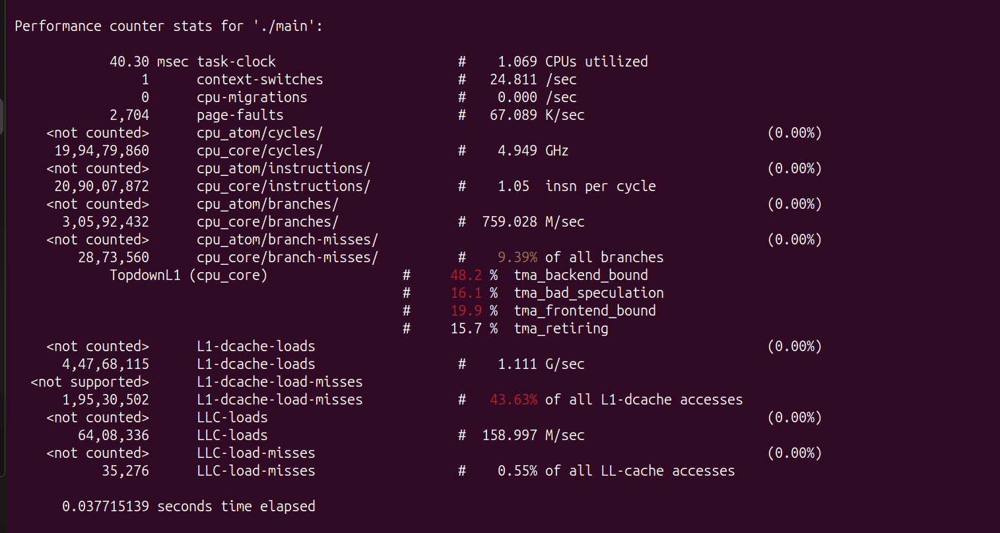
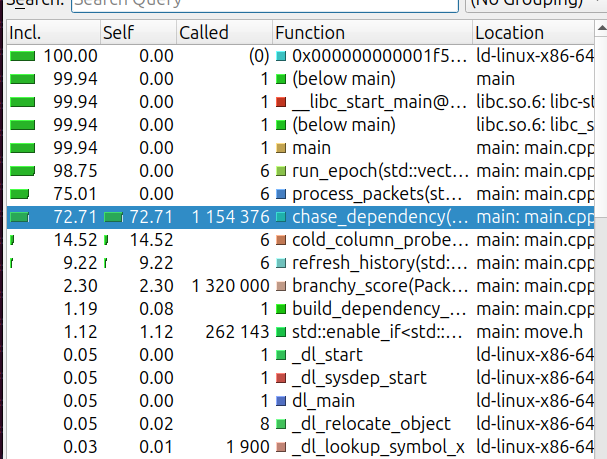
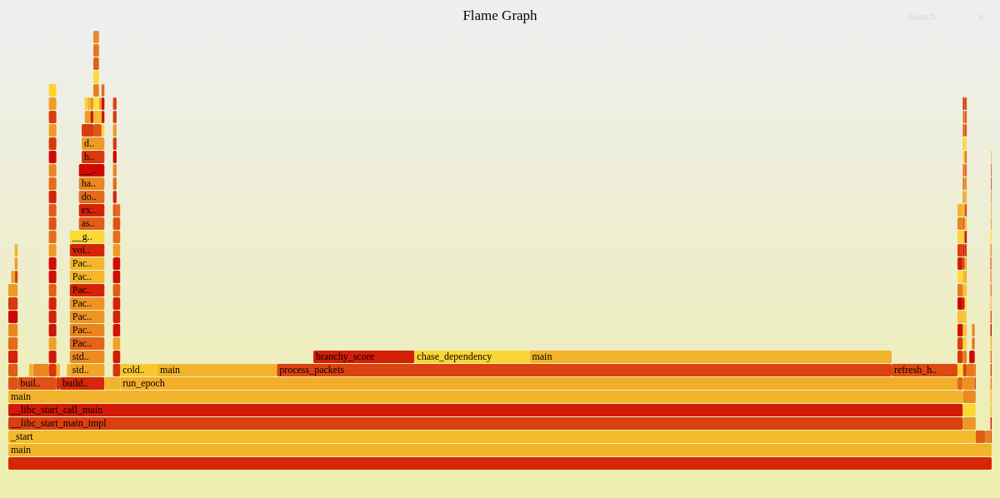
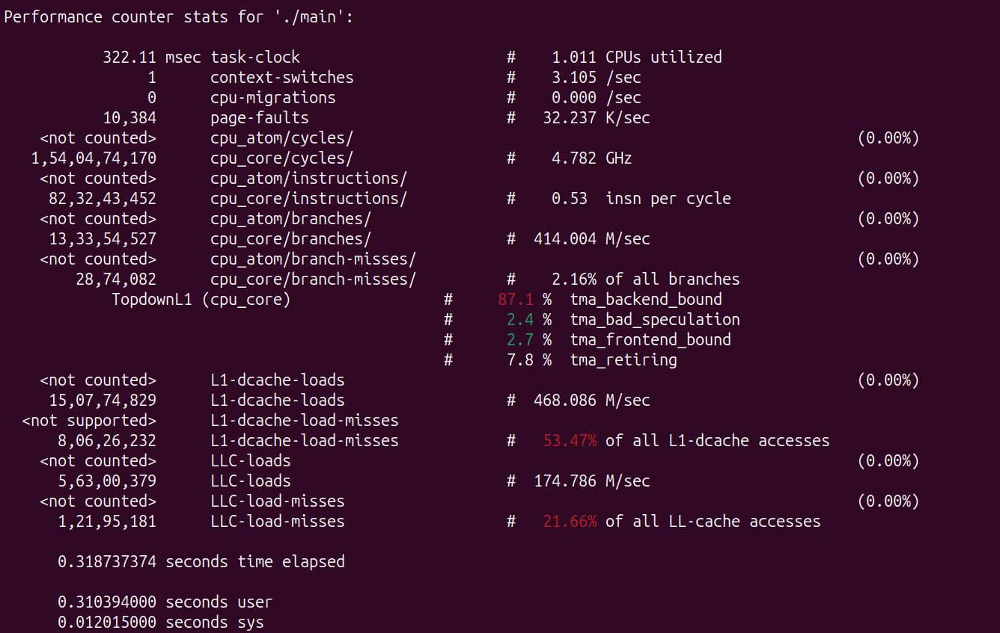
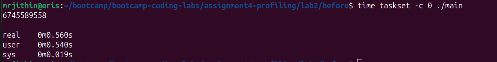

# Performance Assignment Lab 2 - Answers

## 1. Initial Profiling and Hotspot Identification
**Tool used:** `perf stat -d` 



From the initial profiling, several hotspots were identified causing high cache misses, branch mispredictions. 


## 2. Hotspot: `cold_column_probe` and `chase_dependency`
**Tool used:** `kcachegrind`




**Fix:**
The original implementation used a nested column/row loop that accessed memory out of order relative to C++'s row-major memory layout. I refactored the nested loops into a single linear flat loop (`for(int i=0; i<rows*cols; i++)`) to guarantee contiguous sequential cache-friendly access.


## 3. Hotspot: `branchy_score` and `process_packets` (Branch Mispredictions)
**Tool used:** `perf stat -d`


**Fix:**
* **`branchy_score`**: I replaced all the if else blocks with ternary operators. 


## 4. Hotspot: Graph Traversal in `process_packets`
**Tool used:** `flamegraph` 




**Fix:**
Because the initial graph state is static when processing packets, a space-time tradeoff was made. I precomputed the 7-hop paths for all nodes inside `main()` into a `chase_cache` data structure. Inside `process_packets`, this changed the into a fast O(1) array lookup.


## 5. Scaling `history_cols` to `2048`
**Tool used:** `perf stat -d`




**Fix**
Increasing `history_cols` to `2048` exacerbated latency in `refresh_history`. I tested out `#pragma GCC unroll 4` but it was insufficient, I manually unrolled the outer Row loop by 4 and interleaved the independent variables. This allowed Out of Order execution increasing IPC to ~1.3.

## Final performance report:


To run the program, 

```bash
cd after
make run
time taskset -c 0 ./main
```

Before: 


After:


